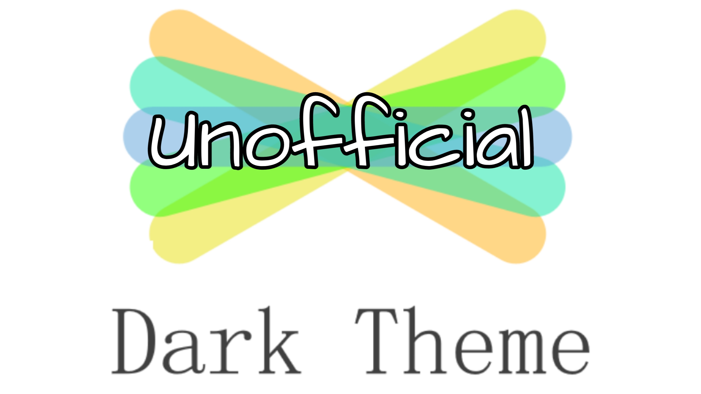

# Seesaw Dark Theme (Extension)

## About the Project

**Seesaw is used by over 10M teachers, students, and family members every month across more than 75% of schools in the U.S. Your work at Seesaw will have broad reach and meaningful impact.**

Many people like to use dark theme when on websites, but Seesaw doesn't have it as a feature built-in so I added it my self and for you to download. With this handy **Browser Extension** it will change the background to a dark theme to make it easier to see along with other parts of the page. 

Hope you that you enjoy my creation on your computer when using Seesaw

*Note: This extension is not affiliated with Seesaw*

## Installing It

- Goto Chrome Settings using three dots on the top right corner.

- Now, Enable developer mode.

- Click on Load Unpacked and select your Unzip folder. Note: You need to select the folder in which the manifest file exists.

- The extension will be installed now.

## Known issues
- Due to the way it works, sometimes it might not work properly.
